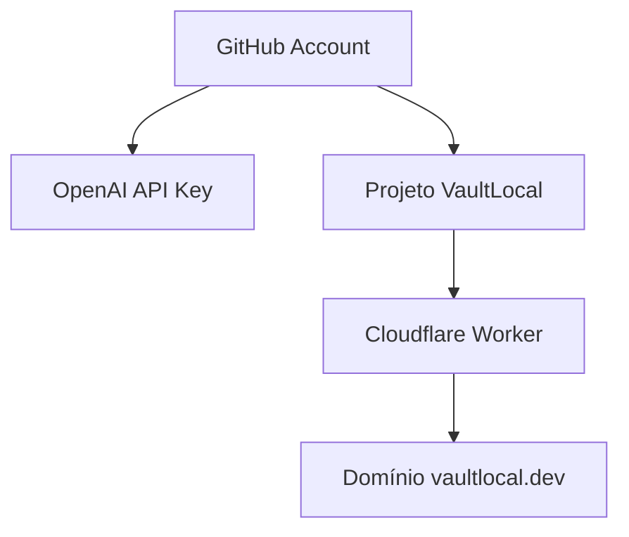

# VaultLocal — Ideias de Features e Inovações de Produto

> **Documento de Conceituação e Ideação de Features**  
> **Status:** Backlog Estratégico / Inovação  
> **Referência:** Complemento direto de [VISAO_ESTRATEGICA.md](file:///home/matheusaraujosami/Documentos/vaultlocal/docs/VISAO_ESTRATEGICA.md)

---

## 🎯 Proposta Central

A maioria dos gerenciadores de senha tradicionais responde apenas:
> *"Onde está minha senha?"*

O **VaultLocal** responde:
> ***"Como está minha vida digital inteira?"***

---

## 💡 Módulos & Ideias de Features

### 1. Digital Legacy (Plano de Legado Digital Criptografado)
* **O Problema:** Na eventualidade de falecimento ou incapacidade, como dependentes ou pessoas de confiança acessam a vida digital e ativos críticos?
* **Solução:**
  * O usuário configura um **Plano de Legado Digital Zero-Knowledge**.
  * **Configurações:**
    * **Beneficiários:** Quem recebe acesso (chaves públicas/contatos autorizados).
    * **Escopo:** Quais ativos/cofres específicos entram no inventário.
    * **Gatilho Temporal (Dead Man's Switch):** Liberação após inatividade prolongada confirmada ou protocolo de validação por múltiplos guardiões (ex: Shamir's Secret Sharing).
    * Todo o processo é cifrado ponta a ponta.

---

### 2. Security Timeline (Linha do Tempo da Segurança Pessoal)
* **Conceito:** Em vez de exibir apenas um retrato estático do momento, mostrar a evolução histórica da postura de segurança.
* **Exemplos de Linha do Tempo:**
  * `2026-08`: 5 senhas reutilizadas detectadas.
  * `2026-09`: Redução para 3 senhas reutilizadas.
  * `2026-10`: 0 senhas reutilizadas (Meta atingida).
* **Marcos de Segurança Registrados:**
  * ✅ *GitHub MFA ativado*
  * ✅ *AWS Root credentials removidas e chave rotacionada*
  * ✅ *Personal Access Token expirado revogado*

---

### 3. Relationship Graph (Grafo de Relacionamento entre Ativos)
* **Conceito:** Visualizador em grafo conectando serviços, projetos e segredos — *um "Obsidian para ativos digitais"*.
* **Exemplo Visual:**

* **Utilidade:** Permite identificar dependências críticas, raio de impacto (*blast radius*) de um vazamento e facilidade de rotação em cascata.

---

### 4. Emergency Mode (Modo de Resposta a Emergência)
* **Cenário:** Notebook ou smartphone roubado/perdido.
* **Mecanismo:**
  * Botão de ação rápida: 🚨 **Modo Emergência**
  * Não depende de execução perigosa não-supervisionada, mas fornece uma rota tática de contenção guiada.
* **Checklist Imediato de Mitigação:**
  - [ ] Revogar sessões ativas do GitHub
  - [ ] Desconectar e invalidar tokens Google
  - [ ] Rotacionar chaves de acesso AWS / Cloudflare
  - [ ] Forçar encerramento de sessões bancárias e e-mails
  - [ ] Trocar senhas das credenciais marcadas como críticas

---

### 5. Security Playbooks (Procedimentos Guiados de Incidente)
* **Conceito:** Inspirado em playbooks corporativos de SOC/CSIRT, adaptados para o usuário comum.
* **Exemplo — Playbook: Conta Google Comprometida:**
  1. Alteração forçada da senha principal
  2. Revogação de todas as sessões e dispositivos ativos
  3. Auditoria do método MFA e códigos de backup
  4. Revisão e remoção de permissões de apps de terceiros conectados
  5. Geração de log e relatório pós-incidente para conferência

---

### 6. Personal Runbooks (Automações e Checklists de Vida Pessoal)
* **Público:** Especialmente orientado para cultura de ITOps/DevOps aplicada à vida civil.
* **Casos de Uso:**
  * **Comprar Veículo:** Documento do carro, apólice de seguro, licenciamento, parcelas de financiamento, chave reserva.
  * **Trocar de Emprego:** Contrato assinado, comprovantes/holerites, benefícios, encerramento de acessos corporativos antigos, atualização profissional.
  * **Viagens Internacionais:** Passaporte, visto, apólice de seguro-viagem, cartões com aviso de viagem ativo, reservas e vouchers.
  * **Abrir Empresa / PJ:** Contrato social, certificado digital e-CNPJ, contas PJ, senhas fiscais.

---

### 7. Privacy Score (Medidor de Exposição de Privacidade)
* **Diferencial:** Não avalia apenas a entropia de strings de senha, mas sim a cobertura de privacidade e proteção dos serviços cadastrados.
* **Avaliação:**
  * Provedores com 2FA/MFA ativo vs inativo
  * Serviços com histórico de vazamentos públicos conhecidos
  * Nível de telemetria ou exposição de dados
  * Score explicável e determinístico: ex: `78/100`

---

### 8. Secret Expiration Center (Central de Vencimento de Segredos)
* **O Problema:** Desenvolvedores e engenheiros geram tokens, certificados SSL e chaves de API que expiram sem aviso, quebrando serviços ou gerando brechas.
* **Visão de Próximos Vencimentos:**
  * 🔴 **7 dias:** Certificado SSL `api.meudominio.com`
  * 🟡 **15 dias:** GitHub Personal Access Token (PAT)
  * 🟢 **30 dias:** Renovação do domínio `vaultlocal.dev`

---

### 9. Project Vaults (Cofres Contextuais por Projeto)
* **Conceito:** Agrupamento nativo de ativos por iniciativa/projeto em vez de pastas genéricas.
* **Exemplo de Estrutura:**
  * 📁 **Projeto: VaultLocal**
    * Domínios (`vaultlocal.dev`)
    * DNS / Cloudflare API
    * Repositório GitHub
    * Credenciais de Deploy / Servidor
    * Documentação e Seeds
  * 📁 **Projeto: Notificações Slack / Git**
    * Webhooks
    * Tokens de Bot
    * Credenciais de Banco

---

## 🏆 Os 3 Grandes Diferenciais Competitivos

Quando combinados, esses 3 pilares posicionam o VaultLocal em uma categoria única no mercado:

| Pilar | Descrição | Impacto |
|---|---|---|
| **1. Digital Life Dashboard** | Visão holística da saúde, risco e prontidão digital do indivíduo | Transcende o cofre de texto |
| **2. Asset Vault** | Trata todo documento, token, chave, cartão e serviço como um ativo | Centralização de valor real |
| **3. Life Events & Runbooks** | Organização contextual baseada em momentos concretos da vida | Utilidade prática e diária |
